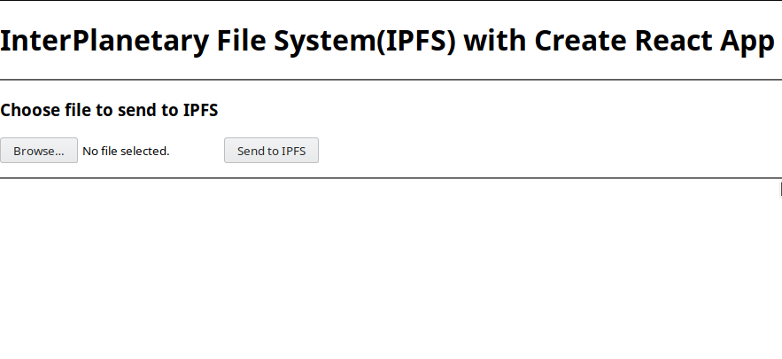
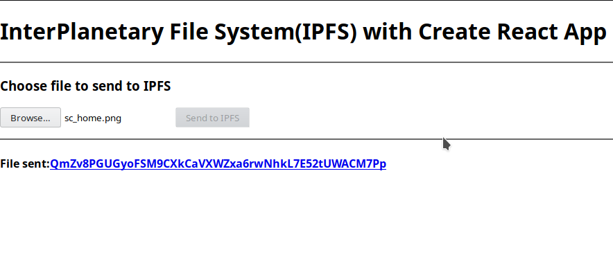

# ipfs-react-example

This is example implement IPFS on ReactJS and use Docker to build, run and ship

## Requirements

To use this example, you must to install:

- Docker
- Docker-compose

## Easy to build, run and ship

You only need to run this command to start:

```bash
docker-compose up
```

## Architecture

In this project, include services:

1. **Client-side:** ReactJS build on NodeJS (on port ``3000`` development)
1. **IPFS:**
    - IPFS Swarm on port 4001
    - IPFS API on port 5001
    - IPFS Gateway on port 8080

## Screenshot

Example:



Upload successful:

